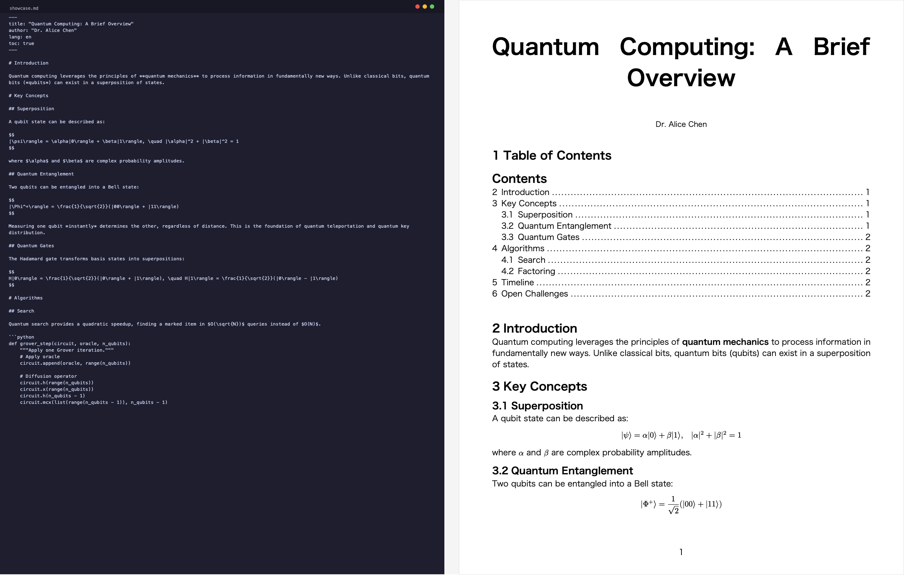
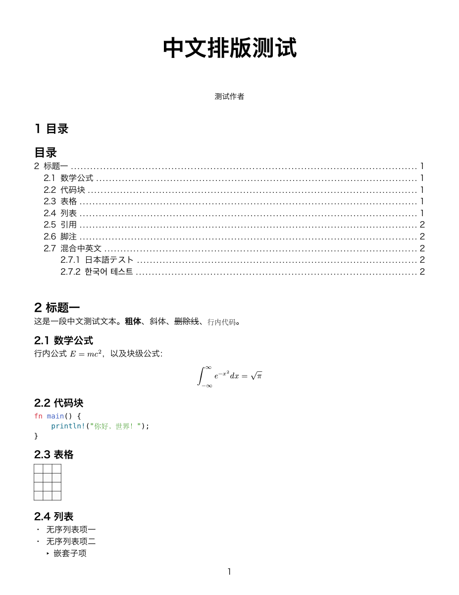

# mdxport

Markdown to PDF via [Typst](https://typst.app). Single binary, no dependencies.

- LaTeX math support (`$E = mc^2$`, `\frac{a}{b}`)
- Built-in templates or bring your own `.typ`
- YAML frontmatter (title, author, language, TOC)
- Watch mode — recompile on file change
- CJK support with `mdxport fonts install`

## Output Examples

<p align="center">
  
</p>

<p align="center">
  <em>Markdown source (left) → PDF output (right): math, TOC, code highlighting, footnotes</em>
</p>

<details>
<summary>CJK output (Chinese/Japanese/Korean)</summary>
<p align="center">
  
</p>
</details>

## Install

```sh
# npm (recommended)
npm install -g @mdxport/cli

# or via npx (no install)
npx @mdxport/cli input.md -o output.pdf

# or cargo
cargo install mdxport
```

## CLI Usage

```sh
# Basic conversion
mdxport input.md -o output.pdf

# Choose a style
mdxport input.md -s classic-editorial

# Custom template
mdxport input.md --template my_style.typ

# Override metadata
mdxport input.md -t "My Title" -a "Author Name" --lang zh

# Watch mode
mdxport input.md -w

# Multiple files
mdxport chapter1.md chapter2.md -o output_dir/

# From stdin
cat input.md | mdxport -o output.pdf
```

## Frontmatter

```yaml
---
title: "Document Title"
author: "Single Author"
# or multiple:
authors:
  - Alice
  - Bob
lang: zh  # auto-detected if omitted
toc: true
---
```

## Custom Templates

Templates are Typst files that define an `#article` function:

```typst
#let article(
  title: none,
  authors: (),
  lang: "en",
  toc: false,
  body,
) = {
  // your styling here
  body
}
```

See `src/template/modern_tech.typ` and `src/template/classic_editorial.typ` for examples.

## Architecture

```
Markdown ──comrak──→ AST ──convert──→ Typst markup
                                         │
                            LaTeX math ──tex2typst-rs──→ Typst math
                                         │
                              template ──compose──→ full .typ source
                                         │
                          typst crate ──compile──→ PDF bytes
```

## Web Version

Prefer a browser UI? Try [mdxport.com](https://mdxport.com), the web version with real-time preview, Mermaid diagrams, and AI Markdown formatting. No install needed. ([source](https://github.com/cosformula/mdxport))

## License

MIT
